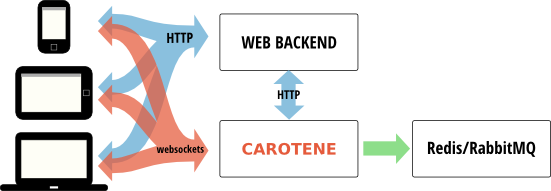

Back messaging
==============

Carotene can be configured to republish every message received to a **RabbitMQ** queue or a **Redis PubSub** channel.

This is useful if you want to connect other services to Carotene, for instance for analysis and monitorization of activity.

Redis
~~~~~
To configure Redis as back broker, use the following configuration option:

.. code-block:: erlang

    [{carotene, [
        % ... Other configuration options
        {broker, redis}
        ]},
    }]}

And Carotene will republish messages to Redis channels with the same names as the Carotene channels.

RabbitMQ
~~~~~~~~
To configure RabbitMQ as back broker, use the following configuration option:

.. code-block:: erlang

    [{carotene, [
        % ... Other configuration options
        {broker, rabbitmq}
        ]},
    }]}

And Carotene will republish messages to RabbitMQ fanout exchanges with the same names as the Carotene channels.
