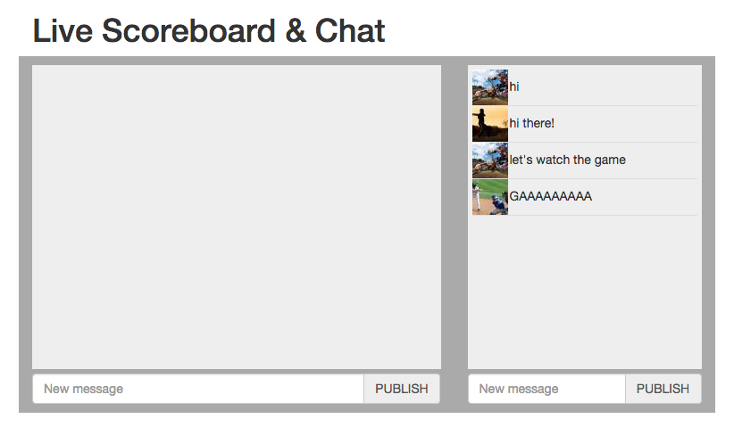

.. _scoreboard-authentication-label:

Authenticating Users
====================

In the first step, we saw how to create a simple chat in Carotene: :ref:`scoreboard-simplechat-label`

In this one, we will se how to identify users from our backend. Authenticating users is basic for many real-time applications. You may want to send messages from your backend to each users with notifications for instance if they have received a new message or if they have received a new payment. Also, is a prerrequisite for authorization, that we will cover in another step.

In many applications, we will have a backend that receives HTTP requests and sends appropiate responses written in our favorite technology. This backend can be written in any language and framework, and now we want to complement it to add real-time capabilities for certain features or sections of our app without having to rewrite everything or duplicate code.

We have in our backend a database of users and mechanisms to register and log in users. But, once logged in, we want to authenticate them in the real-time services.

Let's reuse your existent user providers. You will have to provide an endpoint where Carotene will issue ``POST`` requests with authentication petitions, so your backend can decide who is authenticated and who is not.

Edit the Carotene configuration to add a URL of your backend where you will implement this security check:

.. code-block:: erlang

    [{carotene, [
        % ... Other configuration options
        {authenticate_url, "http://mybackend.com/authenticate_carotene/"}
    }]}

Your configuration file is located in ``_rel/carotene/releases/VERSION/sys.config``, relative to your carotene instalation. Substitute ``VERSION`` for your version of Carotene.

Once you have changed the configuration, restart Carotene to reload the configuration::

    $ _rel/carotene/bin/carotene stop
    $ _rel/carotene/bin/carotene start

In the client code, add these lines of JavaScript, after initializing Carotene.

.. code-block:: javascript

    Carotene.authenticate({
        userId: "myUserId",
        token: "somesecrettoken",
    });

When you render the page in your backend, provide these two pieces of information so that they are available in the rendered HTML code and can be placed in this place. Every web technology has a different way of rendering pages, so just do it your way. The only important thing is that ``userId`` is something that identifies your user in your application and ``token`` is a secret string that can be used to check if the user is who he says.

There are may ways to generate these tokens. It can be from an Oauth Token to something you generate for the user. You can use, for instance, HMAC. See a good explanation about this topic in `this post <https://blog.jcoglan.com/2012/06/09/why-you-should-never-use-hash-functions-for-message-authentication/>`_.

Now it is time to write the server-side code that will check authentication requests. It depends on languages and frameworks, but for instance in PHP/Symfony would be something like this:

.. code-block:: php

    /**
     * @Route("/carotene-auth")
     */
    public function authenticateAction(Request $request)
    {
        $userId = $request->request->get('user_id');
        $token = $request->request->get('token');

        // Your authentication code
        // $authenticated = auth($userId, $token);
        // (You can just set $authenticated = true; to continue the tutorial)

        if ($authenticated) {
            $result = json_encode(array(
                    'authenticated' => true,
                    'user_data' => array('avatar' => 'http://lorempixel.com/40/40/sports?v='.rand())));
        } else {
            $result = json_encode(array(
                    'authenticated' => false,
                    ));
        }
        $response = new Response($result);
        $response->headers->set('Content-Type', 'application/json');
        return $response;
    }

The point here is that we will receive a POST request, with two parameters ``user_id`` and ``token``, that will be the same that we sent to Carotene from JavaScript.

Then, if we decide that the token is valid for the user, we return a JSON encoded string with ``authenticated`` set to ``true`` and ``user_data`` set to an array or structure that contains some additional data that you want to make available to the client side. In this case we will attach a random avatar.

It the token is invalid, then return ``authenticated`` with value ``false``.

If you just want to continue the tutorial without implementing a token authorization mechanism right now, just return ``authenticated: true`` in every case.

Now we will change the JavaScript code to attach the avatar of identified users when they publish a message.

.. code-block:: javascript

    Carotene.subscribe({channel: 'chat',
            onMessage: function(message) {
                if (message.userData == 'undefined') {
                    $('#general-chatbox').append('
'+message.message+'
');
                } else {
                    $('#general-chatbox').append('
'+message.message+'
');
                }
                var chatbox = $('#general-chatbox');
                chatbox.scrollTop(chatbox.prop("scrollHeight"));
            }
        });

This is what we have built so far:

In the next step we will add presence information to know the list of users that are subscribed in a particular moment.

Check out the next step of the tutorial: :ref:`scoreboard-presence-label`
