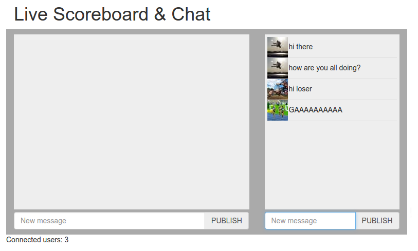

.. _scoreboard-presence-label:

Adding Presence
===============

In this step, we will add to our live scoreboard a counter of the users that are subscribed to the chat in a given moment.

Many real-time applications need presence. You may even use presence in your backend to see the list of users that are online in your application by setting up a common channel for authenticated users.

Adding presence is easy. Just enable it in your Carotene configuration in ``_rel/carotene/releases/VERSION/sys.config``, relative to your Carotene installation. Substitute ``VERSION`` for your version of Carotene.

.. code-block:: erlang

    [{carotene, [
        % ... Other configuration options
        {presence, true}
    }]}

Once you have changed the configuration, restart Carotene to reload the configuration::

    $ _rel/carotene/bin/carotene stop
    $ _rel/carotene/bin/carotene start

And now we can make this call in our JavaScript code:

.. code-block:: javascript

    setInterval(function(){ 
        Carotene.presence({ channel: 'chat' });
    }, 2000);

    Carotene.setOnPresence(function(presence) {
        $('#connected').text(presence.subscribers.length);
    });

Finally, add a HTMl element to the bottom of the scoreboard where we will update the counter of users:

.. code-block:: html

    

        Connected users: 0
    

With these changes, we will get a live counter of the number of users subscribed every two seconds.

Note that a user can have several connections open to the same page, so we will only count the number of unique authenticated users connected.

This is what we have built so far:

This step was quick. In the next one we will see how can we restrict access to a set of users to a channel.

Check out the next step of the tutorial: :ref:`scoreboard-authorization-label`

We are always looking for ways to improve the documentation. If you have problems or suggestions, open a `pull request <https://github.com/carotene/carotene-docs>`_ or send us an email at nacho@limenius.com.
